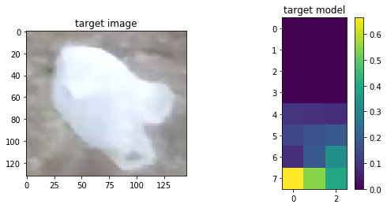
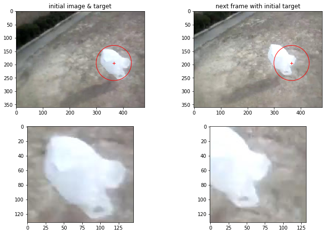

# Kernel-based object tracking

2017/6 NCTU Computer Vision Term Project

> NOTICE:
> This file use *MathJax* with *Markdown*,
> for correct preview [Pandoc Markdown] is suggested
> And if you're using [Atom], [markdown-preview-enhanced] is recommended

[Pandoc Markdown]: http://pandoc.org/MANUAL.html
[Atom]: https://atom.io/
[markdown-preview-enhanced]: https://atom.io/packages/markdown-preview-enhanced

## Problem

Object tracing技術在諸多場合中可做為一個有效節省運算量的方法，諸如在過去作業中我們知道要mapping到一個已知物體需要相當高的計算量，若作為監控的應用下難以對每個frame進行計算，因此我們需要一個有效的object tracking方法來協助。

## Method

實作 *Comaniciu, D., Ramesh, V., & Meer, P. (2003). Kernel-based object tracking. IEEE Transactions on pattern analysis and machine intelligence, 25(5), 564-577.*

此方法大略分為幾個步驟：
1. 使用kernel function將目標區域的pdf轉成target model
2. 計算兩組target model間的Bhattacharyya distance
3. 找出可以最小化Bhattacharyya distance的位移量
4. 移動window

對所有frame以迭代方式重複上述過程直至完成

以下說明各步驟內容

### Kernel

此方法使用Kernel將圖片的資訊進行轉換，使用之kernel為epancechnikov profile
$$
k(x)=\begin{cases}
    \frac{1}{2} c^{-1}_d (d+2) (1-x)   & x \leqq 1
    \\
    0 & otherwise
   \end{cases}
$$

由於在計算中使用方式皆為 $K(x) = C k{({\|\frac{y-x}{h}\|})}$ 之形式，故改寫為
$$
K(x) = \begin{cases}
    C(1-x^2)   & x \leqq 1
    \\
    0 & otherwise
   \end{cases}
$$

normalized後的kernel樣式如下圖

### Target model

在每一個frame中會將圖片的pdf以kernel進行轉換

$$
\hat{q}_u = C \sum^n_{i=1}{
    k({\|x^*_i\|^2})
    \delta
    [b(x^*_i)-u]
}
$$

而上述流程中已經將kernel $k(x)$ 轉換為 $K(x) = C k{({\|\frac{y-x}{h}\|})}$ 之形式，故代換為
$$
\hat{q}_u = \sum^n_{i=1}{
    K({\|x^*_i\|})
    \delta
    [b(x^*_i)-u]
}
$$

其中
1. $u$ 是對應到底幾個bin
2. $x^*_i$ 是正規化到$[0, 1]$的座標
3. $b(x)$ 是該座標對應的bin
4. $\delta$ 是[Kronecker delta function](https://en.wikipedia.org/wiki/Kronecker_delta)，即為內積

套用上式對於一個輸入的圖片可將其轉換為一個target model，下圖縱軸為bin，橫軸為channel

### Bhattacharyya Coefficient

論文中定義兩個分布間的距離為
$$
d(y) = \sqrt{
    1 - \rho\left[{
        \hat{p}(y) - \hat{q}
    }\right]
}
\tag{1}
$$

其中
$$
\hat{\rho}(y)
    \equiv \rho\left[{
        \hat{p}(y) - \hat{q}
    }\right]
    = \sum^m_{u=1}{\sqrt{
        \hat{p}_u(y) \hat{q}_u
    }}
$$

即來自[Bhattacharyya Coefficient](https://en.wikipedia.org/wiki/Bhattacharyya_distance#Bhattacharyya_coefficient)

要追蹤物體則我們需要最小化Bhattacharyya distance，需要最小化距離(1)，而該式可導向最大化下式(2)

$$
\rho\left[{
        \hat{p}(y) - \hat{q}
    }\right]
\approx
\frac{1}{2}\sum\sqrt{\hat{p}_u(\hat{y}_0)\hat{q}_u} +
\frac{C_h}{2}\sum{w_i k\left({
    \left\| \frac{y-x_i}{h} \right\|
}^2 \right)}
\tag{2}
$$

其中
$$
w_i = \sum^m_{u=1}{
    \sqrt{\frac{ \hat{q}_u }{ \hat{p}_u(\hat{y}_0) }}
} \delta [ b(x_i) -u ]
$$

而在計算時，每個frame的計算中$y_0$, $q$不會變動，故 $\hat{p}(\hat{y}_0)\hat{q}$ 基本上相當於一個常數；因此計算的重點是 $w$

### Meanshift

使用meanshift方法決定window要往哪個方向移動
$$
\hat{y}_1= \frac{
    \sum^{n_h}_{i=1}{x_i w_i g\left(\left\|\frac{\hat{y}_0 - x_i}{h}\right\|^2\right)}
}{
    \sum^{n_h}_{i=1}{w_i g\left(\left\|\frac{\hat{y}_0 - x_i}{h}\right\|^2\right)}
}
$$

其中$g(x)=-k'(x)$，是為了避免邊角的值位移權重影響過大而加上去的mask

### 結果

以*bag*這個資料集第1個frame作為target，第2個frame作為candidate

透過以上操作可以計算出位移量 (-18, -2)

對所有frame重複以上流程直到完成

## Implementation

本實作使用Python撰寫，**需求**版本如下
- python 3.6

使用套件如下 *(不確定其向下相容性)*
- opencv 3.2.0
- numpy 1.12.1
- matplotlib 2.0.2

另，執行本次提交的檔案會需要[Jupyter]，並確定可以連上帶有以上dependency的[ipykernel]

[Jupyter]: http://jupyter.org/install.html
[ipykernel]: https://github.com/ipython/ipykernel

## Execution

### Dataset

需要[VOT2016 dataset]，下載後解壓縮放置於`<folder>/data`下

[VOT2016 dataset]: http://www.votchallenge.net/vot2016/dataset.html

### Run

隨本報告附上之檔案中包含兩個`.ipynb`檔可用Jupyter執行，其中

- [run.ipynb] 可執行上述流程並產出結果
- [detail.ipynb] 內容與本報告雷同，但有各步驟與code之對應資訊

(點擊連結可以預覽Notebook內容)

所帶的其他`.py`檔案是寫給`run.ipynb`用的dependency，無法獨立運行

[run.ipynb]: https://nbviewer.jupyter.org/github/tzing/ktracking/blob/master/run.ipynb
[detail.ipynb]: https://nbviewer.jupyter.org/github/tzing/ktracking/blob/master/detail.ipynb

## Result

- Youtube link
    - [bag](https://youtu.be/HxoUzaFtkKk)
    - [bolt](https://youtu.be/MwQ_3OiYptw)
    - [bmx](https://youtu.be/cNQuw8qwuvw)
    - [fernando](https://youtu.be/kt6j9sjPQSY)

- Vidoe file
    - attached in this zip file
